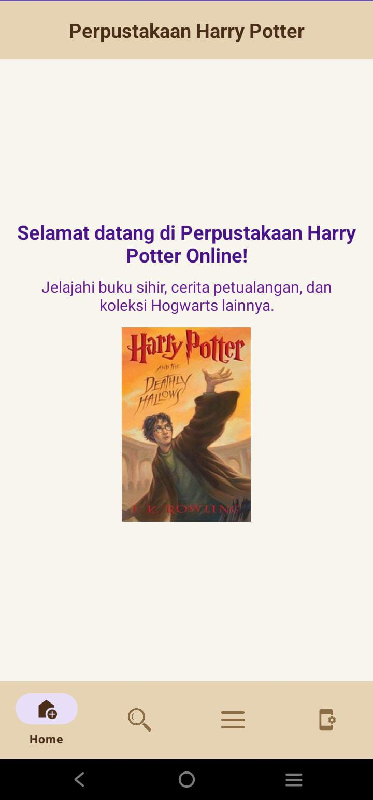
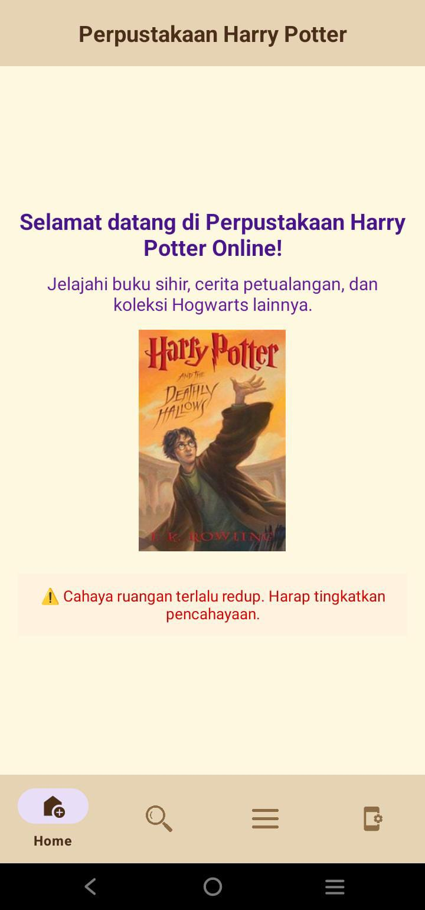

Aplikasi Android yang menampilkan koleksi buku Harry Potter menggunakan API eksternal. Aplikasi ini dibuat untuk latihan praktikum Mobile Programming di Android Studio.

## 🧩 Fitur Aplikasi
- Menampilkan daftar buku Harry Potter
- Detail informasi setiap buku (judul, penulis, deskripsi)
- UI menarik menggunakan CardView dan RecyclerView
- Navigasi antar halaman dengan Fragment dan BottomNavigationView
- Mendukung banyak pengguna

## 📸 Screenshot

### Halaman Utama

### Halaman jika sensor terdeteksi

### Halaman login

### Halaman register

### Notifikasi

### Halaman list buku

> Screenshot bisa kamu ambil dari emulator, lalu upload ke folder `screenshots` di repo GitHub kamu.
## 👩‍💻 Developer
Maulidya (mohon maaf jika ada eror)
